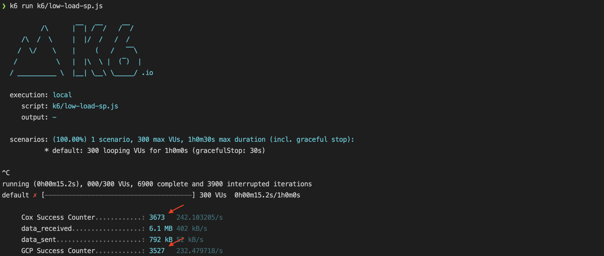
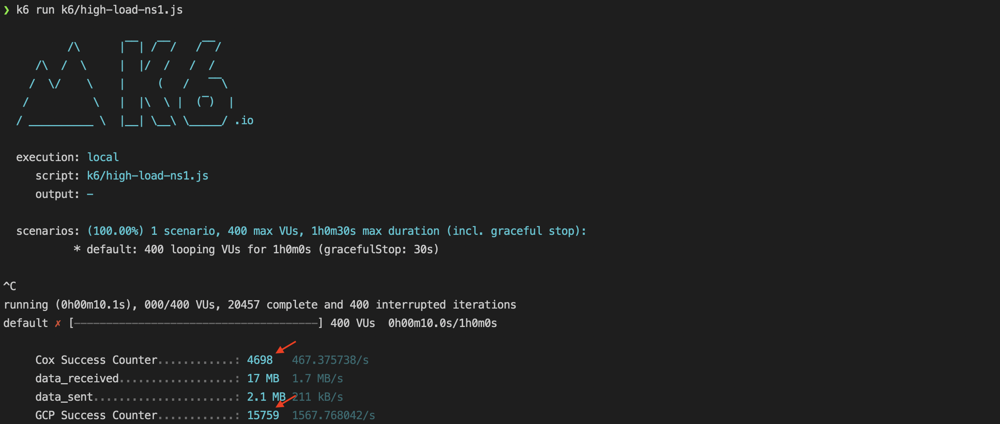

# Table of Contents

+ **[Requirements](#requirements)**
+ **[Topology](#topology)**
  + **[Cox Cluster](#cox-cluster)**
    + **[External DNS](#namespace-external-dns)**
    + **[Nginx Deployments](#namespace-nginx)**
  + **[GCP Cluster](#gcp-cluster)**
    + **[External DNS](#namespace-external-dns-1)**
    + **[Nginx Replica Sets](#namespace-nginx-1)**
+ **[Initial Expected DNS Provider States](#initial-expected-dns-provider-states)**
  + **[Stackpath](#stackpath)**
  + **[NS1](#ns1)**
+ **[Generating Load](#generating-load)**
  + **[Using K6](#using-k6)**
  + **[Verify Round Robin](#verify-round-robin)**
  + **[Verify Weighting](#verify-weighting)**
  + **[Customize the Script](#customize-the-script)**

+ **[Making Manual Changes](#making-manual-changes)**
  + **[Enable External-DNS](#enable-external-dns)**
  + **[Update Annotations](#update-annotations)**


---

# Requirements

1. Access to the cluster(s) you wish to install external-DNS and a service on (in this case one GCP and one Cox cluster).
2. Kubectl, Kubectx / Kubens for Setting your Kube context.
3. Install the latest version of the [K6 Load Generator](https://k6.io/docs/getting-started/installation/). (Installation using Homebrew was used for prepare this document, though Linux and Windows distributions are available, including via Homebrew on Linux).

---

# Topology

## Cox Cluster 

---

### Namespace: `external-dns`

#### `external-dns-stackpath`

Deployment Manifest File:

```yaml
apiVersion: v1
kind: ServiceAccount
metadata:
  name: external-dns-sp
---
apiVersion: rbac.authorization.k8s.io/v1
kind: ClusterRole
metadata:
  name: external-dns-sp
rules:
  - apiGroups: [""]
    resources: ["services"]
    verbs: ["get","watch","list"]
  - apiGroups: [""]
    resources: ["pods"]
    verbs: ["get","watch","list"]
  - apiGroups: ["networking","networking.k8s.io"]
    resources: ["ingresses"]
    verbs: ["get","watch","list"]
  - apiGroups: [""]
    resources: ["nodes"]
    verbs: ["get","watch","list"]
  - apiGroups: [""]
    resources: ["endpoints"]
    verbs: ["get","watch","list"]
---
apiVersion: rbac.authorization.k8s.io/v1
kind: ClusterRoleBinding
metadata:
  name: external-dns-sp-viewer
roleRef:
  apiGroup: rbac.authorization.k8s.io
  kind: ClusterRole
  name: external-dns-sp
subjects:
- kind: ServiceAccount
  name: external-dns-sp
  namespace: external-dns
---
apiVersion: apps/v1
kind: Deployment
metadata:
  name: external-dns-sp
spec:
  strategy:
    type: Recreate
  selector:
    matchLabels:
      app: external-dns-sp
  template:
    metadata:
      labels:
        app: external-dns-sp
    spec:
      serviceAccountName: external-dns-sp
      containers:
      - name: external-dns
        image: aveshasystems/external-dns:v0.12.2
        args:
        - --source=service
        - --provider=stackpath
        - --txt-owner-id=CLUSTER-ID #ADD A UNIQUE CLUSTER ID
        - --domain-filter=DOMAIN.TLD #USE YOUR DOMAIN AND API KEYS
        env:
        - name: STACKPATH_CLIENT_ID
          value: "STACKPATH_CLIENT_ID"
        - name: STACKPATH_CLIENT_SECRET
          value: "STACKPATH_CLIENT_SECRET"
        - name: STACKPATH_STACK_ID
          value: "STACKPATH_STACK_ID"
        resources:
            requests:
              cpu: 100m
              memory: 64Mi
            limits:
              cpu: 200m
              memory: 128Mi
```

Successful Deployment:

`k get all -n external-dns`

Expected Result:

```
NAME                                  READY   STATUS    RESTARTS   AGE
pod/external-dns-sp-5bcf6b5f4-gwfg6   1/1     Running   0          58m

NAME                              READY   UP-TO-DATE   AVAILABLE   AGE
deployment.apps/external-dns-sp   1/1     1            1           77m

NAME                                        DESIRED   CURRENT   READY   AGE
replicaset.apps/external-dns-sp-5bcf6b5f4   1         1         1       77m
```

---

#### `external-dns-ns1`

Deployment Manifest File:

```yaml
apiVersion: v1
kind: ServiceAccount
metadata:
  name: external-dns-ns1
---
apiVersion: rbac.authorization.k8s.io/v1
kind: ClusterRole
metadata:
  name: external-dns-ns1
rules:
  - apiGroups: [""]
    resources: ["services"]
    verbs: ["get","watch","list"]
  - apiGroups: [""]
    resources: ["pods"]
    verbs: ["get","watch","list"]
  - apiGroups: ["networking","networking.k8s.io"]
    resources: ["ingresses"]
    verbs: ["get","watch","list"]
  - apiGroups: [""]
    resources: ["nodes"]
    verbs: ["get","watch","list"]
  - apiGroups: [""]
    resources: ["endpoints"]
    verbs: ["get","watch","list"]
---
apiVersion: rbac.authorization.k8s.io/v1
kind: ClusterRoleBinding
metadata:
  name: external-dns-ns1-viewer
roleRef:
  apiGroup: rbac.authorization.k8s.io
  kind: ClusterRole
  name: external-dns-ns1
subjects:
- kind: ServiceAccount
  name: external-dns-ns1
  namespace: external-dns
---
apiVersion: apps/v1
kind: Deployment
metadata:
  name: external-dns-ns1
spec:
  strategy:
    type: Recreate
  selector:
    matchLabels:
      app: external-dns-ns1
  template:
    metadata:
      labels:
        app: external-dns-ns1
    spec:
      serviceAccountName: external-dns-ns1
      containers:
      - name: external-dns
        image: aveshasystems/external-dns:v0.12.2
        args:
        - --source=service
        - --provider=ns1
        - --txt-owner-id=DOMAIN.TLD #USE YOUR DOMAIN AND API KEYS
        - --domain-filter=CLUSTER-ID #UNIQUE CLUSTER ID
        env:
        - name: NS1_APIKEY
          value: "NS1_APIKEY"
        resources:
          requests:
            cpu: 100m
            memory: 64Mi
          limits:
            cpu: 200m
            memory: 128Mi
```

Successful Deployment:

`k get all -n external-dns`

Expected Result:

```
NAME                                    READY   STATUS    RESTARTS   AGE
pod/external-dns-ns1-7d7bcd84c8-jxtjp   1/1     Running   0          3m6s
pod/external-dns-sp-5bcf6b5f4-gwfg6     1/1     Running   0          66m

NAME                               READY   UP-TO-DATE   AVAILABLE   AGE
deployment.apps/external-dns-ns1   1/1     1            1           3m7s
deployment.apps/external-dns-sp    1/1     1            1           85m

NAME                                          DESIRED   CURRENT   READY   AGE
replicaset.apps/external-dns-ns1-7d7bcd84c8   1         1         1       3m7s
replicaset.apps/external-dns-sp-5bcf6b5f4     1         1         1       85m
```

---

### Namespace: `nginx`

*As a LoadBalancer was not able to be used on this cluster, the below `nodePort` solution is used to advertise the nginx instance to the public. The external IP for the LoadBalancer was set manually upon finding the external IP of the Node hosting the Deployment.*

#### Deployment:`nginx-stackpath`

Deployment Manifest File:

```yaml
apiVersion: apps/v1
kind: Deployment
metadata:
  name: nginx-sp
spec:
  selector:
    matchLabels:
      app: nginx-sp
  template:
    metadata:
      labels:
        app: nginx-sp
    spec:
      containers:
      - image: nginx
        name: nginx-sp
        ports:
        - containerPort: 80
        resources:
            requests:
              cpu: 50m
              memory: 64Mi
            limits:
              cpu: 80m
              memory: 128Mi
---
apiVersion: v1
kind: Service
metadata:
  name: nginx-sp
  annotations:
    external-dns.alpha.kubernetes.io/hostname: SUB.DOMAIN.TLD #USE YOUR DOMAIN OR A SUB
    external-dns.alpha.kubernetes.io/ttl: "1" #IN SECONDS
spec:
  externalIPs:
  - 98.190.75.21 #MANUALLY CHANGE TO NODE EXTERNAL IP
  selector:
    app: nginx-sp
  type: LoadBalancer
  ports:
    - nodePort: 30080
      protocol: TCP
      port: 80
      targetPort: 80
```

Successful Deployment:

`k get services -n nginx`

Expected Result:

```
NAME        TYPE           CLUSTER-IP      EXTERNAL-IP    PORT(S)        AGE
nginx-sp    LoadBalancer   10.43.138.131   98.190.75.21   80:30080/TCP   76m
```

---

#### Deployment:`nginx-ns1`

Deployment Manifest File:

```yaml
apiVersion: apps/v1
kind: Deployment
metadata:
  name: nginx-ns1
spec:
  selector:
    matchLabels:
      app: nginx-ns1
  template:
    metadata:
      labels:
        app: nginx-ns1
    spec:
      containers:
      - image: nginx
        name: nginx-ns1
        ports:
        - containerPort: 80
        resources:
            requests:
              cpu: 50m
              memory: 64Mi
            limits:
              cpu: 80m
              memory: 128Mi
---
apiVersion: v1
kind: Service
metadata:
  name: nginx-ns1
  annotations:
    external-dns.alpha.kubernetes.io/hostname: SUB.DOMAIN.TLD #USE YOUR DOMAIN OR A SUB
    external-dns.alpha.kubernetes.io/ttl: "1" #IN SECONDS
    external-dns.alpha.kubernetes.io/weight: "25" #MANUAL WEIGHT
spec:
  externalIPs:
  - 98.190.75.21 #MANUALLY CHANGE TO NODE EXTERNAL IP
  selector:
    app: nginx-ns1
  type: LoadBalancer
  ports:
    - nodePort: 30081
      protocol: TCP
      port: 80
      targetPort: 80
```

Successful Deployment:

`k get services -n nginx`

Expected Result:

```
NAME        TYPE           CLUSTER-IP      EXTERNAL-IP    PORT(S)        AGE
nginx-ns1   LoadBalancer   10.43.29.111    98.190.75.21   80:30081/TCP   3m4s
nginx-sp    LoadBalancer   10.43.138.131   98.190.75.21   80:30080/TCP   76m
```

## GCP Cluster

### Namespace: `external-dns`

#### `external-dns-stackpath`

Deployment Manifest File:

```yaml
apiVersion: v1
kind: ServiceAccount
metadata:
  name: external-dns-sp
---
apiVersion: rbac.authorization.k8s.io/v1
kind: ClusterRole
metadata:
  name: external-dns-sp
rules:
  - apiGroups: [""]
    resources: ["services"]
    verbs: ["get","watch","list"]
  - apiGroups: [""]
    resources: ["pods"]
    verbs: ["get","watch","list"]
  - apiGroups: ["networking","networking.k8s.io"]
    resources: ["ingresses"]
    verbs: ["get","watch","list"]
  - apiGroups: [""]
    resources: ["nodes"]
    verbs: ["get","watch","list"]
  - apiGroups: [""]
    resources: ["endpoints"]
    verbs: ["get","watch","list"]
---
apiVersion: rbac.authorization.k8s.io/v1
kind: ClusterRoleBinding
metadata:
  name: external-dns-sp-viewer
roleRef:
  apiGroup: rbac.authorization.k8s.io
  kind: ClusterRole
  name: external-dns-sp
subjects:
- kind: ServiceAccount
  name: external-dns-sp
  namespace: external-dns
---
apiVersion: apps/v1
kind: Deployment
metadata:
  name: external-dns-sp
spec:
  strategy:
    type: Recreate
  selector:
    matchLabels:
      app: external-dns-sp
  template:
    metadata:
      labels:
        app: external-dns-sp
    spec:
      serviceAccountName: external-dns-sp
      containers:
      - name: external-dns
        image: aveshasystems/external-dns:v0.12.2
        args:
        - --source=service
        - --provider=stackpath
        - --txt-owner-id=CLUSTER-ID #ADD A UNIQUE CLUSTER ID
        - --domain-filter=DOMAIN.TLD #USE YOUR DOMAIN AND API KEYS
        env:
        - name: STACKPATH_CLIENT_ID
          value: "STACKPATH_CLIENT_ID"
        - name: STACKPATH_CLIENT_SECRET
          value: "STACKPATH_CLIENT_SECRET"
        - name: STACKPATH_STACK_ID
          value: "STACKPATH_STACK_ID"
        resources:
            requests:
              cpu: 100m
              memory: 64Mi
            limits:
              cpu: 200m
              memory: 128Mi
```

Successful Deployment:

`k get all -n external-dns`

Expected Result:

```
NAME                                   READY   STATUS    RESTARTS   AGE
pod/external-dns-sp-86459c5c47-2wdpd   1/1     Running   0          11m

NAME                              READY   UP-TO-DATE   AVAILABLE   AGE
deployment.apps/external-dns-sp   1/1     1            1           11m

NAME                                         DESIRED   CURRENT   READY   AGE
replicaset.apps/external-dns-sp-86459c5c47   1         1         1       11m
```

---

#### `external-dns-ns1`

Deployment Manifest File:

```yaml
apiVersion: v1
kind: ServiceAccount
metadata:
  name: external-dns-ns1
---
apiVersion: rbac.authorization.k8s.io/v1
kind: ClusterRole
metadata:
  name: external-dns-ns1
rules:
  - apiGroups: [""]
    resources: ["services"]
    verbs: ["get","watch","list"]
  - apiGroups: [""]
    resources: ["pods"]
    verbs: ["get","watch","list"]
  - apiGroups: ["networking","networking.k8s.io"]
    resources: ["ingresses"]
    verbs: ["get","watch","list"]
  - apiGroups: [""]
    resources: ["nodes"]
    verbs: ["get","watch","list"]
  - apiGroups: [""]
    resources: ["endpoints"]
    verbs: ["get","watch","list"]
---
apiVersion: rbac.authorization.k8s.io/v1
kind: ClusterRoleBinding
metadata:
  name: external-dns-ns1-viewer
roleRef:
  apiGroup: rbac.authorization.k8s.io
  kind: ClusterRole
  name: external-dns-ns1
subjects:
- kind: ServiceAccount
  name: external-dns-ns1
  namespace: external-dns
---
apiVersion: apps/v1
kind: Deployment
metadata:
  name: external-dns-ns1
spec:
  strategy:
    type: Recreate
  selector:
    matchLabels:
      app: external-dns-ns1
  template:
    metadata:
      labels:
        app: external-dns-ns1
    spec:
      serviceAccountName: external-dns-ns1
      containers:
      - name: external-dns
        image: aveshasystems/external-dns:v0.12.2
        args:
        - --source=service
        - --provider=ns1
        - --txt-owner-id=DOMAIN.TLD #USE YOUR DOMAIN AND API KEYS
        - --domain-filter=CLUSTER-ID #UNIQUE CLUSTER ID
        env:
        - name: NS1_APIKEY
          value: "NS1_APIKEY"
        resources:
          requests:
            cpu: 100m
            memory: 64Mi
          limits:
            cpu: 200m
            memory: 128Mi
```

Successful Deployment:

`k get all -n external-dns`

```
NAME                                    READY   STATUS    RESTARTS   AGE
pod/external-dns-ns1-559cb7c484-jnkn9   1/1     Running   0          32s
pod/external-dns-sp-7dc8b77f8f-7lb8p    1/1     Running   0          5m39s

NAME                               READY   UP-TO-DATE   AVAILABLE   AGE
deployment.apps/external-dns-ns1   1/1     1            1           2m53s
deployment.apps/external-dns-sp    1/1     1            1           21m

NAME                                          DESIRED   CURRENT   READY   AGE
replicaset.apps/external-dns-ns1-559cb7c484   1         1         1       32s
replicaset.apps/external-dns-sp-7dc8b77f8f    1         1         1       5m39s
```

---

### Namespace: `nginx`

####  Replica Set: `nginx-stackpath`

Deployment Manifest File:

```yaml
apiVersion: apps/v1
kind: Deployment
metadata:
  name: nginx-sp
spec:
  replicas: 1
  selector:
    matchLabels:
      app: nginx-sp
  template:
    metadata:
      labels:
        app: nginx-sp
    spec:
      containers:
      - image: nginx
        name: nginx-sp
        ports:
        - containerPort: 80
        resources:
            requests:
              cpu: 200m
              memory: 64Mi
            limits:
              cpu: 400m
              memory: 128Mi
---
apiVersion: v1
kind: Service
metadata:
  name: nginx-sp
spec:
  selector:
    app: nginx-sp
  type: LoadBalancer
  ports:
    - nodePort: 30080
      protocol: TCP
      port: 80
      targetPort: 80
---
apiVersion: v1
kind: Service
metadata:
  name: nginx-sp-ext
  annotations:
    external-dns.alpha.kubernetes.io/hostname: SUB.DOMAIN.TLD #USE YOUR DOMAIN OR A SUB
    external-dns.alpha.kubernetes.io/ttl: "1" #IN SECONDS
spec:
  type: ExternalName
  externalName: 35.199.30.247 #MANUALLY SET TO NODE PUBLIC IP

```

Succesful Deployment:

`k get services -n nginx`

Expected Result:

```
NAME       TYPE           CLUSTER-IP    EXTERNAL-IP     PORT(S)        AGE
nginx-cox   LoadBalancer   10.7.37.230   34.86.70.115    80:30863/TCP   24h
```

---

####  Replica Set: `nginx-ns1`

Deployment Manifest File:

```yaml
apiVersion: apps/v1
kind: Deployment
metadata:
  name: nginx-ns1
spec:
  replicas: 1
  selector:
    matchLabels:
      app: nginx-ns1
  template:
    metadata:
      labels:
        app: nginx-ns1
    spec:
      containers:
      - image: nginx
        name: nginx-ns1
        ports:
        - containerPort: 80
        resources:
            requests:
              cpu: 200m
              memory: 64Mi
            limits:
              cpu: 400m
              memory: 128Mi
---
apiVersion: v1
kind: Service
metadata:
  name: nginx-ns1
spec:
  selector:
    app: nginx-ns1
  type: LoadBalancer
  ports:
    - nodePort: 30081
      protocol: TCP
      port: 80
      targetPort: 80
--- 
apiVersion: v1
kind: Service
metadata:
  name: nginx-ns1-ext
  annotations:
    external-dns.alpha.kubernetes.io/hostname: SUB.DOMAIN.TLD #USE YOUR DOMAIN OR A SUB
    external-dns.alpha.kubernetes.io/ttl: "1" #IN SECONDS
    external-dns.alpha.kubernetes.io/weight: "100" #MANUAL WEIGHT
spec:
  type: ExternalName
  externalName: 35.230.187.66 #MANUALLY SET TO NODE PUBLIC IP
```

Succesful Deployment:

`k get services -n nginx`

Expected Result:

```
NAME        TYPE           CLUSTER-IP    EXTERNAL-IP     PORT(S)        AGE
nginx-cox   LoadBalancer   10.7.37.230   34.86.70.115    80:30863/TCP   24h
nginx-sp    LoadBalancer   10.7.37.15    35.245.96.170   80:30080/TCP   24h
```

---

# Initial Expected DNS Provider States

## Stackpath

Expected Result: 2 A Records for `stackpath.marchesi.dev`, each pointing to the external IP of one of the `nginx` Load Balancers. **Note:** You should have different IPs, manually set in the manifests to the Node's public IP.


---

## NS1

Expected Result: 2 A Records for `ns1.wmar.io`, each pointing to the external IP of one of the `nginx` Load Balancers. **Note:** You should have different IPs, manually set in the manifests to the Node's public IP.


---

# Generating Load

## Using K6

K6 is a lightweight load generator and test suite which was used to generate load as well as verify DNS requests were being sent at the correct frequency.  [Install K6 Here](https://k6.io/docs/getting-started/installation/).

The below is an example K6 test script (we will not use this to generate or verify the DNS results, this is simply an example K6 script).

```js
import http from 'k6/http';
import { sleep } from 'k6';

export default function () {
  http.get('https://test.k6.io');
  sleep(1);
}
```

---

## Verify Round Robin

Once K6 is installed, you are able to begin running tests against your isntallation. Save the below script as `low-load.js` and replace the indicated fields with your configured **StackPath** domain.

```js
import http from 'k6/http';
import { sleep } from 'k6';
import { Counter, Trend } from 'k6/metrics';

const GCPCounter = new Counter('GCP Success Counter');
const CoxCounter = new Counter('Cox Success Counter');
const FailCounter = new Counter('Fail Counter');

const CoxIP = '98.190.75.21'; //SET TO COX NODE PUBLIC IP

export const options = {
    vus: 300,
    duration: '1h',
    dns: {
        ttl: '0',
        policy: 'any',
      },
      noConnectionReuse: true,
      noVUConnectionReuse: true,
}

export default function () {
    const res = http.get('http://stackpath.wmar1.com:30080/'); //CHANGE TO YOUR STACKPATH DOMAIN
    
    if (res.status != 200) {
        FailCounter.add(1);
    } else {
        if (res.remote_ip == CoxIP) {
            CoxCounter.add(1);
        } else {
            GCPCounter.add(1);
        }
    }

    sleep(0.5);
}
```

Once ready, run the script with the command `k6 run low-load.js`.

You will see the test script begin to run and see the iteration counter rapidly increase (by around 600 iterations per second). While the test runs, use the below command to check on the resource usage of an nginx pod:

```shell
kubectl top pods -n nginx
```

Switching between clusters, you will see similar usage on both nginx instances, proving our round robin.

Exit the `low-load.js` script using `Ctrl-C`, and a screen such as that below will be printed with the count of requests sent to each cluster. You should get roughly the same number of requests at each cluster when using StackPath or when using the same weights on all results on NS1. See an example of this output below:



---

## Verify Weighting

Save the below script as `high-load.js` and replace the indicated fields with your configured **NS1** domain. ***Note:** The below script should be run from a VM with a high bandwidth internet connection, and multiple CPU cores.*

```js
import http from 'k6/http';
import { sleep } from 'k6';
import { Counter, Trend } from 'k6/metrics';

const GCPCounter = new Counter('GCP Success Counter');
const CoxCounter = new Counter('Cox Success Counter');
const FailCounter = new Counter('Fail Counter');

const CoxIP = '98.190.75.21';

export const options = {
    vus: 400,
    duration: '1h',
    dns: {
        ttl: '0',
        policy: 'any',
      },
      noConnectionReuse: true,
      noVUConnectionReuse: true,
}

export default function () {
    const res = http.get('http://ns1.wmar.io:30081/');
    
    if (res.status != 200) {
        FailCounter.add(1);
    } else {
        if (res.remote_ip == CoxIP) {
            CoxCounter.add(1);
        } else {
            GCPCounter.add(1);
        }
    }
}
```

Once this test begins, 400 "users" will begin to send GET requests to the specified domain. The users will iterate this requests **with no sleep period**. If you are worried about resource usage by the script, use a VM in GCP, EC2, or Cox.

Once ready, run the script using the below command:

```bash
k6 run high-load.js
```

You will see the test script begin to run and see the iteration counter rapidly increase (by 400 users x no sleep period). While the test runs, use the below command to check on the resource usage of an nginx pod:

```bash
kubectl top pods -n nginx
```

Switching between clusters, you should see drastically different usage levels (roughly 4x usage on GCP versus Cox) on both nginx instances, proving our weighted distribution.

Exit the `high-load.js` script using `Ctrl-C`, and a screen such as that below will be printed with the count of requests sent to each cluster. You should get a drastic Delta between the number of requests sent to Cox and the number of requests sent to GCP. See an example of this output below:



---

## Customize the Script

K6 is an extremely versatile program, and can be used to test almost any application. To explore some more options you could configure which are relevant to this demo, go here: [https://k6.io/docs/using-k6/](https://k6.io/docs/using-k6/).

---

# Making Manual Changes

## Enable External-DNS

First, ensure external-DNS is isntalled on the cluster. See **[here](#namespace-external-dns)** for an example external-DNS YAML manifest.

To enable external-DNS on a service which is already deployed on a cluster, you may either edit and reapply it's original YAML manifest, or use `kubectl edit` to make live changes to the service. Here we will do the latter:

Lets add the annotation to a small nginx server without it. When `k edit service <service_name>` used, a screen similar to the below is displayed:

```yaml
# Please edit the object below. Lines beginning with a '#' will be ignored,
# and an empty file will abort the edit. If an error occurs while saving this file will be
# reopened with the relevant failures.
#
apiVersion: v1
kind: Service
metadata:
  annotations:
    # YOUR ANNOTATIONS HERE
    kubectl.kubernetes.io/last-applied-configuration: |
      {"apiVersion":"v1","kind":"Service","metadata":{"annotations":{},"name":"small-nginx","namespace":"nginx"},"spec":{"ports":[{"port":80,"protocol":"TCP","targetPort":80}],"selector":{"app":"small-nginx"},"type":"LoadBalancer"}}
  creationTimestamp: "2022-09-09T13:51:53Z"
  finalizers:
  - service.kubernetes.io/load-balancer-cleanup
  name: small-nginx
  namespace: nginx
  resourceVersion: "15698207"
  uid: 63d10f0d-d0c8-4ad7-afe4-875173d02b81
spec:
  allocateLoadBalancerNodePorts: true
  clusterIP: 10.7.47.40
  clusterIPs:
  - 10.7.47.40
  externalTrafficPolicy: Cluster
  internalTrafficPolicy: Cluster
  ipFamilies:
  - IPv4
  ipFamilyPolicy: SingleStack
  ports:
  - nodePort: 30548
    port: 80
    protocol: TCP
    targetPort: 80
  selector:
    app: small-nginx
  sessionAffinity: None
  type: LoadBalancer
status:
  loadBalancer:
    ingress:
    - ip: 34.86.70.115
```

If there is no annotations section, add it in the area indicated in the text below. The bare minimum is the addition of a hostname, though TTL and Weight (if supported by the provider) can also be added as shown here:

```yaml
# Please edit the object below. Lines beginning with a '#' will be ignored,
# and an empty file will abort the edit. If an error occurs while saving this file will be
# reopened with the relevant failures.
#
apiVersion: v1
kind: Service
metadata:
  annotations:
    # YOUR ANNOTATIONS HERE
    external-dns.alpha.kubernetes.io/hostname: SUB.DOMAIN.TLD #YOUR DOMAIN OR SUB
    external-dns.alpha.kubernetes.io/ttl: "1" #IN SECONDS
    external-dns.alpha.kubernetes.io/weight: "100" #MANUAL WEIGHT
    kubectl.kubernetes.io/last-applied-configuration: |
      {"apiVersion":"v1","kind":"Service","metadata":{"annotations":{},"name":"small-nginx","namespace":"nginx"},"spec":{"ports":[{"port":80,"protocol":"TCP","targetPort":80}],"selector":{"app":"small-nginx"},"type":"LoadBalancer"}}
  creationTimestamp: "2022-09-09T13:51:53Z"
  finalizers:
  - service.kubernetes.io/load-balancer-cleanup
  name: small-nginx
  namespace: nginx
  resourceVersion: "15698207"
  uid: 63d10f0d-d0c8-4ad7-afe4-875173d02b81
spec:
  allocateLoadBalancerNodePorts: true
  clusterIP: 10.7.47.40
  clusterIPs:
  - 10.7.47.40
  externalTrafficPolicy: Cluster
  internalTrafficPolicy: Cluster
  ipFamilies:
  - IPv4
  ipFamilyPolicy: SingleStack
  ports:
  - nodePort: 30548
    port: 80
    protocol: TCP
    targetPort: 80
  selector:
    app: small-nginx
  sessionAffinity: None
  type: LoadBalancer
status:
  loadBalancer:
    ingress:
    - ip: 34.86.70.115
```

Exit the editor with `Esc` followed by `!wq`, and the changes will be applied. In about a minute, external-DNS will notice the change and update your dns provider.

## Update Annotations

If you wish to manually update annotations that are already set, you can use the same methods described above. To edit a service while live, use `kubectl edit service <service_name>` or make the change in the YAML manifest and reapply.
