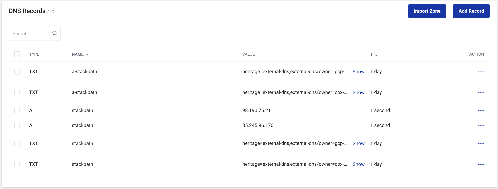
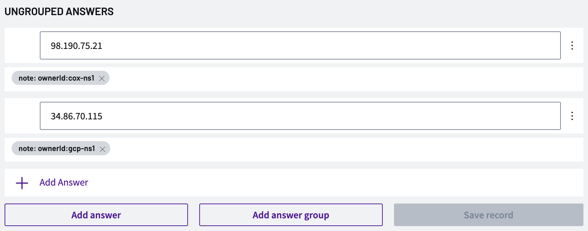

# Table of Contents

+ [**Topology**](#topology)
  + [**Cox Cluster**](#cox-cluster)
    + **[External DNS](#namespace-external-dns)**
      + [Stackpath](#external-dns-stackpath) 
      + [NS1](#external-dns-ns1) 
    + **[Nginx Deployments](#namespace-nginx)**
      + **[Stackpath](#deployment-nginx-stackpath)**
      + **[NS1](#deployment-nginx-ns1)**
  + [**GCP Cluster**](#gcp-cluster)
    + **[External DNS](#namespace-external-dns-1)**
      + [Stackpath](#external-dns-stackpath-1) 
      + [NS1](#external-dns-ns1-1) 
    + **[Nginx Replica Sets](#namespace-nginx-1)**
      + **[Stackpath](#replica-set-nginx-stackpath)**
      + **[NS1](#replica-set-nginx-ns1)**
+ [**Initial Expected DNS Provider States**](#initial-expected-dns-provider-states)
  + [**Stackpath**](#stackpath)
  + [**NS1**](#ns1)

---

# Topology

## Cox Cluster 

---

### Namespace: `external-dns`

#### `external-dns-stackpath`

Deployment Manifest File:

```yaml
apiVersion: v1
kind: ServiceAccount
metadata:
  name: external-dns-sp
---
apiVersion: rbac.authorization.k8s.io/v1
kind: ClusterRole
metadata:
  name: external-dns-sp
rules:
  - apiGroups: [""]
    resources: ["services"]
    verbs: ["get","watch","list"]
  - apiGroups: [""]
    resources: ["pods"]
    verbs: ["get","watch","list"]
  - apiGroups: ["networking","networking.k8s.io"]
    resources: ["ingresses"]
    verbs: ["get","watch","list"]
  - apiGroups: [""]
    resources: ["nodes"]
    verbs: ["get","watch","list"]
  - apiGroups: [""]
    resources: ["endpoints"]
    verbs: ["get","watch","list"]
---
apiVersion: rbac.authorization.k8s.io/v1
kind: ClusterRoleBinding
metadata:
  name: external-dns-sp-viewer
roleRef:
  apiGroup: rbac.authorization.k8s.io
  kind: ClusterRole
  name: external-dns-sp
subjects:
- kind: ServiceAccount
  name: external-dns-sp
  namespace: external-dns
---
apiVersion: apps/v1
kind: Deployment
metadata:
  name: external-dns-sp
spec:
  strategy:
    type: Recreate
  selector:
    matchLabels:
      app: external-dns-sp
  template:
    metadata:
      labels:
        app: external-dns-sp
    spec:
      serviceAccountName: external-dns-sp
      containers:
      - name: external-dns
        image: aveshadev/external-dns:v0.12.2
        args:
        - --source=service
        - --provider=stackpath
        - --txt-owner-id=cox-sp
        - --domain-filter=marchesi.dev
        env:
        - name: STACKPATH_CLIENT_ID
          value: "STACKPATH_CLIENT_ID"
        - name: STACKPATH_CLIENT_SECRET
          value: "STACKPATH_CLIENT_SECRET"
        - name: STACKPATH_STACK_ID
          value: "STACKPATH_STACK_ID"
        resources:
            requests:
              cpu: 100m
              memory: 64Mi
            limits:
              cpu: 200m
              memory: 128Mi
```

Successful Deployment:

`k get all -n external-dns`

Expected Result:

```
NAME                                  READY   STATUS    RESTARTS   AGE
pod/external-dns-sp-5bcf6b5f4-gwfg6   1/1     Running   0          58m

NAME                              READY   UP-TO-DATE   AVAILABLE   AGE
deployment.apps/external-dns-sp   1/1     1            1           77m

NAME                                        DESIRED   CURRENT   READY   AGE
replicaset.apps/external-dns-sp-5bcf6b5f4   1         1         1       77m
```

---

#### `external-dns-ns1`

*Due to a bug in the NS1 implementation, the external-dns image has been updated. Once pushed to an Avesha repo the image reference below will be changed*

Deployment Manifest File:

```yaml
apiVersion: v1
kind: ServiceAccount
metadata:
  name: external-dns-ns1
---
apiVersion: rbac.authorization.k8s.io/v1
kind: ClusterRole
metadata:
  name: external-dns-ns1
rules:
  - apiGroups: [""]
    resources: ["services"]
    verbs: ["get","watch","list"]
  - apiGroups: [""]
    resources: ["pods"]
    verbs: ["get","watch","list"]
  - apiGroups: ["networking","networking.k8s.io"]
    resources: ["ingresses"]
    verbs: ["get","watch","list"]
  - apiGroups: [""]
    resources: ["nodes"]
    verbs: ["get","watch","list"]
  - apiGroups: [""]
    resources: ["endpoints"]
    verbs: ["get","watch","list"]
---
apiVersion: rbac.authorization.k8s.io/v1
kind: ClusterRoleBinding
metadata:
  name: external-dns-ns1-viewer
roleRef:
  apiGroup: rbac.authorization.k8s.io
  kind: ClusterRole
  name: external-dns-ns1
subjects:
- kind: ServiceAccount
  name: external-dns-ns1
  namespace: external-dns
---
apiVersion: apps/v1
kind: Deployment
metadata:
  name: external-dns-ns1
spec:
  strategy:
    type: Recreate
  selector:
    matchLabels:
      app: external-dns-ns1
  template:
    metadata:
      labels:
        app: external-dns-ns1
    spec:
      serviceAccountName: external-dns-ns1
      containers:
      - name: external-dns
        image: wmarchesi123/edns:fix  #Update once fix is pushed to an Avesha repo
        args:
        - --source=service
        - --provider=ns1
        - --txt-owner-id=cox-ns1
        - --domain-filter=wmar.io
        env:
        - name: NS1_APIKEY
          value: "NS1_APIKEY"
        resources:
          requests:
            cpu: 100m
            memory: 64Mi
          limits:
            cpu: 200m
            memory: 128Mi
```

Successful Deployment:

`k get all -n external-dns`

Expected Result:

```
NAME                                    READY   STATUS    RESTARTS   AGE
pod/external-dns-ns1-7d7bcd84c8-jxtjp   1/1     Running   0          3m6s
pod/external-dns-sp-5bcf6b5f4-gwfg6     1/1     Running   0          66m

NAME                               READY   UP-TO-DATE   AVAILABLE   AGE
deployment.apps/external-dns-ns1   1/1     1            1           3m7s
deployment.apps/external-dns-sp    1/1     1            1           85m

NAME                                          DESIRED   CURRENT   READY   AGE
replicaset.apps/external-dns-ns1-7d7bcd84c8   1         1         1       3m7s
replicaset.apps/external-dns-sp-5bcf6b5f4     1         1         1       85m
```

---

### Namespace: `nginx`

*As a LoadBalancer was not able to be used on this cluster, the below `nodePort` solution is used to advertise the nginx instance to the public. The external IP for the LoadBalancer was set manually upon finding the external IP of the Node hosting the Deployment.*

#### Deployment:`nginx-stackpath`

Deployment Manifest File:

```yaml
apiVersion: apps/v1
kind: Deployment
metadata:
  name: nginx-sp
spec:
  selector:
    matchLabels:
      app: nginx-sp
  template:
    metadata:
      labels:
        app: nginx-sp
    spec:
      containers:
      - image: nginx
        name: nginx-sp
        ports:
        - containerPort: 80
        resources:
            requests:
              cpu: 100m
              memory: 64Mi
            limits:
              cpu: 200m
              memory: 128Mi
---
apiVersion: v1
kind: Service
metadata:
  name: nginx-sp
  annotations:
    external-dns.alpha.kubernetes.io/hostname: stackpath.marchesi.dev
    external-dns.alpha.kubernetes.io/ttl: "1"
spec:
  externalIPs:
  - 98.190.75.21
  selector:
    app: nginx-sp
  type: LoadBalancer
  ports:
    - nodePort: 30080
      protocol: TCP
      port: 80
      targetPort: 80

```

Successful Deployment:

`k get services -n nginx`

Expected Result:

```
NAME        TYPE           CLUSTER-IP      EXTERNAL-IP    PORT(S)        AGE
nginx-sp    LoadBalancer   10.43.138.131   98.190.75.21   80:30080/TCP   76m
```

---

#### Deployment:`nginx-ns1`

Deployment Manifest File:

```yaml
apiVersion: apps/v1
kind: Deployment
metadata:
  name: nginx-cox
spec:
  selector:
    matchLabels:
      app: nginx-cox
  template:
    metadata:
      labels:
        app: nginx-cox
    spec:
      containers:
      - image: nginx
        name: nginx-cox
        ports:
        - containerPort: 80
        resources:
            requests:
              cpu: 100m
              memory: 64Mi
            limits:
              cpu: 200m
              memory: 128Mi
---
apiVersion: v1
kind: Service
metadata:
  name: nginx-ns1
  annotations:
    external-dns.alpha.kubernetes.io/hostname: ns1.wmar.io
    external-dns.alpha.kubernetes.io/ttl: "1"
spec:
  externalIPs:
  - 98.190.75.21
  selector:
    app: nginx-ns1
  type: LoadBalancer
  ports:
    - nodePort: 30081
      protocol: TCP
      port: 80
      targetPort: 80
```

Successful Deployment:

`k get services -n nginx`

Expected Result:

```
NAME        TYPE           CLUSTER-IP      EXTERNAL-IP    PORT(S)        AGE
nginx-ns1   LoadBalancer   10.43.29.111    98.190.75.21   80:30081/TCP   3m4s
nginx-sp    LoadBalancer   10.43.138.131   98.190.75.21   80:30080/TCP   76m
```

## GCP Cluster

### Namespace: `external-dns`

#### `external-dns-stackpath`

Deployment Manifest File:

```yaml
apiVersion: rbac.authorization.k8s.io/v1
kind: ClusterRoleBinding
metadata:
  name: external-dns-sp-viewer
roleRef:
  apiGroup: rbac.authorization.k8s.io
  kind: ClusterRole
  name: external-dns-sp
subjects:
- kind: ServiceAccount
  name: external-dns-sp
  namespace: external-dns
---
apiVersion: apps/v1
kind: Deployment
metadata:
  name: external-dns-sp
spec:
  strategy:
    type: Recreate
  selector:
    matchLabels:
      app: external-dns-sp
  template:
    metadata:
      labels:
        app: external-dns-sp
    spec:
      serviceAccountName: external-dns-sp
      containers:
      - name: external-dns
        image: aveshadev/external-dns:v0.12.2
        args:
        - --source=service
        - --provider=stackpath
        - --txt-owner-id=gcp-sp
        - --domain-filter=stackpath.marchesi.dev
        env:
        - name: STACKPATH_CLIENT_ID
          value: <STACKPATH_CLIENT_ID>
        - name: STACKPATH_CLIENT_SECRET
          value: <STACKPATH_CLIENT_SECRET>
        - name: STACKPATH_STACK_ID
          value: <STACK_ID>
```

Successful Deployment:

`k get all -n external-dns`

Expected Result:

```
NAME                                   READY   STATUS    RESTARTS   AGE
pod/external-dns-sp-86459c5c47-2wdpd   1/1     Running   0          11m

NAME                              READY   UP-TO-DATE   AVAILABLE   AGE
deployment.apps/external-dns-sp   1/1     1            1           11m

NAME                                         DESIRED   CURRENT   READY   AGE
replicaset.apps/external-dns-sp-86459c5c47   1         1         1       11m
```

---

#### `external-dns-ns1`

*Due to a bug in the NS1 implementation, the external-dns image has been updated. Once pushed to an Avesha repo the image reference below will be changed*

Deployment Manifest File:

```yaml
apiVersion: v1
kind: ServiceAccount
metadata:
  name: external-dns-ns1
---
apiVersion: rbac.authorization.k8s.io/v1
kind: ClusterRole
metadata:
  name: external-dns-ns1
rules:
  - apiGroups: [""]
    resources: ["services"]
    verbs: ["get","watch","list"]
  - apiGroups: [""]
    resources: ["pods"]
    verbs: ["get","watch","list"]
  - apiGroups: ["networking","networking.k8s.io"]
    resources: ["ingresses"]
    verbs: ["get","watch","list"]
  - apiGroups: [""]
    resources: ["nodes"]
    verbs: ["get","watch","list"]
  - apiGroups: [""]
    resources: ["endpoints"]
    verbs: ["get","watch","list"]
---
apiVersion: rbac.authorization.k8s.io/v1
kind: ClusterRoleBinding
metadata:
  name: external-dns-ns1-viewer
roleRef:
  apiGroup: rbac.authorization.k8s.io
  kind: ClusterRole
  name: external-dns-ns1
subjects:
- kind: ServiceAccount
  name: external-dns-ns1
  namespace: external-dns
---
apiVersion: apps/v1
kind: Deployment
metadata:
  name: external-dns-ns1
spec:
  strategy:
    type: Recreate
  selector:
    matchLabels:
      app: external-dns-ns1
  template:
    metadata:
      labels:
        app: external-dns-ns1
    spec:
      serviceAccountName: external-dns-ns1
      containers:
      - name: external-dns
        image: wmarchesi123/edns:fix #Update once fix is pushed to an Avesha repo
        args:
        - --source=service
        - --provider=ns1
        - --txt-owner-id=gcp-ns1
        - --domain-filter=wmar.io
        env:
        - name: NS1_APIKEY
          value: <NS1_APIKEY>
```

Successful Deployment:

`k get all -n external-dns`

```
NAME                                    READY   STATUS    RESTARTS   AGE
pod/external-dns-ns1-559cb7c484-jnkn9   1/1     Running   0          32s
pod/external-dns-sp-7dc8b77f8f-7lb8p    1/1     Running   0          5m39s

NAME                               READY   UP-TO-DATE   AVAILABLE   AGE
deployment.apps/external-dns-ns1   1/1     1            1           2m53s
deployment.apps/external-dns-sp    1/1     1            1           21m

NAME                                          DESIRED   CURRENT   READY   AGE
replicaset.apps/external-dns-ns1-559cb7c484   1         1         1       32s
replicaset.apps/external-dns-sp-7dc8b77f8f    1         1         1       5m39s
```

---

### Namespace: `nginx`

####  Replica Set: `nginx-stackpath`

Deployment Manifest File:

```yaml
apiVersion: apps/v1
kind: Deployment
metadata:
  name: nginx-sp
spec:
  replicas: 4
  selector:
    matchLabels:
      app: nginx-sp
  template:
    metadata:
      labels:
        app: nginx-sp
    spec:
      containers:
      - image: nginx
        name: nginx-sp
        ports:
        - containerPort: 80
        resources:
            requests:
              cpu: 100m
              memory: 64Mi
            limits:
              cpu: 200m
              memory: 128Mi
---
apiVersion: v1
kind: Service
metadata:
  name: nginx-sp
  annotations:
    external-dns.alpha.kubernetes.io/hostname: stackpath.marchesi.dev
    external-dns.alpha.kubernetes.io/ttl: "1"
spec:
  selector:
    app: nginx-sp
  type: LoadBalancer
  ports:
    - protocol: TCP
      port: 80
      targetPort: 80
```

Succesful Deployment:

`k get services -n nginx`

Expected Result:

```
NAME       TYPE           CLUSTER-IP    EXTERNAL-IP     PORT(S)        AGE
nginx-cox   LoadBalancer   10.7.37.230   34.86.70.115    80:30863/TCP   24h
```

---

####  Replica Set: `nginx-ns1`

Deployment Manifest File:

```yaml
apiVersion: apps/v1
kind: Deployment
metadata:
  name: nginx-cox
spec:
  replicas: 4
  selector:
    matchLabels:
      app: nginx-cox
  template:
    metadata:
      labels:
        app: nginx-cox
    spec:
      containers:
      - image: nginx
        name: nginx-cox
        ports:
        - containerPort: 80
        resources:
            requests:
              cpu: 100m
              memory: 64Mi
            limits:
              cpu: 200m
              memory: 128Mi
---
apiVersion: v1
kind: Service
metadata:
  name: nginx-cox
  annotations:
    external-dns.alpha.kubernetes.io/hostname: ns1.wmar.io
    external-dns.alpha.kubernetes.io/ttl: "1"
spec:
  selector:
    app: nginx-cox
  type: LoadBalancer
  ports:
    - protocol: TCP
      port: 80
      targetPort: 80
```

Succesful Deployment:

`k get services -n nginx`

Expected Result:

```
NAME        TYPE           CLUSTER-IP    EXTERNAL-IP     PORT(S)        AGE
nginx-cox   LoadBalancer   10.7.37.230   34.86.70.115    80:30863/TCP   24h
nginx-sp    LoadBalancer   10.7.37.15    35.245.96.170   80:30080/TCP   24h
```

---

# Initial Expected DNS Provider States

## Stackpath

Expected Result: 2 A Records for `stackpath.marchesi.dev`, each pointing to the external IP of one of the `nginx` Load Balancers.



---

## NS1

Expected Result: 2 A Records for `ns1.wmar.io`, each pointing to the external IP of one of the `nginx` Load Balancers.


